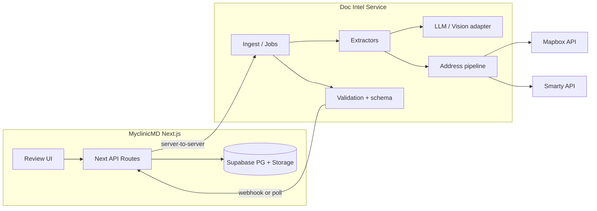

# Immigration Document Intelligence API — Product & Engineering Spec

**Audience:** Principal engineer + BD. **Use:** Hand Section 12 to a Cursor agent to implement the service.

**Version:** 1.0.0  
**Status:** Specification (not implemented by this doc)

---

## 1. Executive summary (BD + technical)

### What we are building

A **backend service** (microservice) that:

- Accepts **immigration-related documents** (PDFs/images) and **extracts structured data** using **hybrid extraction** (deterministic PDF fields + **OpenAI** / vision for scans and messy layouts).
- Applies **dynamic form definitions** stored in **Supabase** (new USCIS / civil-surgeon / portal forms can be onboarded without redeploying the core engine).
- Normalizes and validates **addresses** via **Mapbox** (geocoding, autocomplete, suggestions) and **Smarty** (USPS-grade validation / verification where appropriate).
- Returns **review-ready payloads** to **MyclinicMD** (Next.js): field values, **confidence**, **evidence** (page + bounding region or text span), and **validation errors** — not “silent truth.”

### Is this a good idea?

| Pros | Cons / risks |
|------|----------------|
| **Differentiation:** EMR-native workflow vs desktop one-off tools (e.g. folder batch scripts). | **Compliance:** PHI in transit to OpenAI requires **BAA**, data minimization, and often **Azure OpenAI** / private deployment for serious healthcare customers. |
| **Extensibility:** Dynamic form registry beats hard-coded field maps per form revision. | **Cost:** Vision + LLM per page; must cache, batch, and tier (fast path for fillable PDFs). |
| **Monetization:** Module pricing (“Immigration / civil surgeon pack”), per-seat or per-extraction. | **Portal automation:** Automating government sites (e.g. eMedical) is **brittle** and **policy-sensitive** — keep **human submit**; API focuses on **extraction + validation + export**. |
| **Stickiness:** Data lives in **your** Postgres with **audit** — not a siloed desktop app. | **Vendor lock-in:** Abstract LLM + geocode providers behind interfaces. |

**Verdict:** **Yes**, as a **document intelligence + validation** layer integrated with MyclinicMD, with **explicit human review** and **no mandatory fragile browser automation** in v1. Position automation as optional later.

---

## 2. System boundaries



- **MyclinicMD** owns: auth, RLS, patient/encounter/document rows, audit log events, user-facing UI.
- **Doc Intel service** owns: long-running jobs, extraction pipelines, calling OpenAI/Mapbox/Smarty, merging results with **form definitions** read from Supabase (via service role or read replica — see Section 5).

---

## 3. What we need from the database (Supabase / Postgres)

These can live in the **existing** MyclinicMD database (recommended) so RLS and joins stay simple. The microservice uses a **dedicated DB role** with **least privilege** (see Section 8).

### 3.1 Tables to add (conceptual)

| Table | Purpose |
|-------|---------|
| `form_definitions` | Logical form: `id`, `slug` (e.g. `i-693-v2024`), `name`, `jurisdiction`, `active_version`, `metadata` JSON. |
| `form_definition_versions` | Immutable version: `form_id`, `version`, `effective_from`, `storage_path` (Supabase Storage path to JSON schema), `checksum`, `created_by`. |
| `form_field_specs` | Optional denormalized cache of fields; or load entirely from Storage JSON — team choice. If in DB: `form_version_id`, `field_key`, `type`, `required`, `validation_regex`, `address_policy` (none / suggest / verify_usps), `help_text`. |
| `extraction_jobs` | `id`, `patient_id`, `encounter_id` (nullable), `document_id` (FK to `patient_documents` or storage path), `form_slug` + `form_version`, `status`, `idempotency_key`, `created_at`, `error_code`, `processor_version`. |
| `extraction_results` | `job_id`, `raw_extractor_output` JSONB (encrypted-at-rest optional), `normalized_fields` JSONB, `field_confidence` JSONB, `evidence` JSONB (page, bbox, quote), `address_resolutions` JSONB, `llm_model`, `prompt_version`. |
| `extraction_reviews` | Human edits: `job_id`, `user_id`, `patch` JSONB, `submitted_at` — for audit and model improvement (opt-in). |

### 3.2 Storage (Supabase Storage)

- **Bucket** (e.g. `form-schemas`): versioned JSON per `form_definition_version` — **source of truth** for dynamic fields.
- **Bucket** (existing): `patient-documents` — service receives **signed URL** or **internal fetch** via EMR after auth.

### 3.3 What the customer / ops provides

- **Supabase service role key** or **narrow scoped JWT** for worker (prefer **custom claims** + restricted policies).
- **OpenAI** (or Azure OpenAI) API key with **approved data processing** terms.
- **Mapbox** token (server-side secret).
- **Smarty** auth ID + token.
- **Webhook secret** (HMAC) for callbacks from microservice → Next.js.

---

## 4. Form definition format (Storage JSON — dynamic forms)

The Cursor agent should implement a **JSON Schema** or well-documented JSON contract, e.g.:

```json
{
  "form_slug": "i-693",
  "version": "2024-11",
  "fields": [
    {
      "key": "applicant.last_name",
      "type": "string",
      "required": true,
      "pdf_acroform_aliases": ["LastName", "Pt1Line1aFamilyName"],
      "extraction_hint": "Family name in Part 1",
      "address_policy": "verify_usps",
      "max_length": 80
    }
  ],
  "llm_extraction_instructions": "Optional short domain instructions for this form revision."
}
```

**Rule:** New government form = **new Storage object + new `form_definition_versions` row** + optional admin UI in MyclinicMD to upload JSON. **No redeploy** of extraction binaries for mapping-only changes.

---

## 5. What the API exposes to the Next.js frontend (via MyclinicMD BFF)

**Never** call the microservice directly from the browser with secrets. Pattern:

`Browser → Next.js API route (Supabase session) → Doc Intel API (service credential)`

### 5.1 Endpoints (microservice)

| Method | Path | Description |
|--------|------|-------------|
| `POST` | `/v1/jobs` | Create extraction job: `{ document_ref, form_slug, form_version?, idempotency_key, callback_url? }`. Returns `{ job_id, status }`. |
| `GET` | `/v1/jobs/{job_id}` | Job status + partial results. |
| `GET` | `/v1/jobs/{job_id}/result` | Final normalized payload when `succeeded`. |
| `POST` | `/v1/addresses/resolve` | Optional sync helper: `{ freeform_or_components, country }` → Mapbox + Smarty merged suggestion (rate-limited). |
| `POST` | `/v1/internal/forms/reload` | Admin: invalidate form schema cache (auth: internal only). |

### 5.2 Result payload shape (to frontend)

```json
{
  "job_id": "uuid",
  "status": "needs_review",
  "form": { "slug": "i-693", "version": "2024-11" },
  "fields": {
    "applicant.last_name": { "value": "Doe", "confidence": 0.98, "source": "acroform" },
    "applicant.mailing_street": {
      "value": "123 Main St",
      "confidence": 0.72,
      "source": "llm_vision",
      "evidence": { "page": 1, "bbox": [0.1, 0.2, 0.4, 0.22], "quote": "123 Main St" }
    }
  },
  "addresses": [
    {
      "field_key": "applicant.mailing_street",
      "mapbox": { "place_id": "...", "formatted": "..." },
      "smarty": { "dpv_match_code": "Y", "footnotes": [] },
      "recommended_value": "123 MAIN ST",
      "flags": ["verify_with_patient"]
    }
  ],
  "validation_errors": [],
  "processor": { "build": "git-sha", "llm_model": "gpt-4.1-mini", "prompt_version": "pv-12" }
}
```

Frontend responsibility: **diff UI**, accept/reject per field, write patches to `extraction_reviews` and merge into encounter/patient as your product rules allow.

---

## 6. Extraction pipeline (best-of-breed behavior)

1. **Classify** document type (optional small model or rules + filename).
2. **Fast path:** If PDF has AcroForm widgets matching `pdf_acroform_aliases`, read values **without** LLM.
3. **Slow path:** Rasterize pages or extract images + text; **OpenAI vision** (or equivalent) with **JSON mode / structured outputs**; require **per-field evidence** for any LLM-sourced value.
4. **Merge** with precedence: AcroForm > OCR text match > LLM (configurable).
5. **Normalize** dates, phones, A-numbers per form rules in JSON spec.
6. **Address pipeline:** Mapbox for geocode + standardization candidate; Smarty for **US** verification / ZIP+4 where `address_policy` requires it.
7. **Validate** against JSON Schema derived from form definition; emit `validation_errors`.

---

## 7. OpenAI usage principles (for implementers)

- **System prompt:** You are a structured extraction engine; output **only** valid JSON matching schema; **never** invent; if unreadable return `null` and low confidence.
- **User content:** Page images + optional extracted text; include **form_slug** and **field list** from dynamic definition.
- **No** long chain-of-thought in production; use **low temperature** for extraction.
- **Log:** `prompt_version`, model id, **token counts**; **do not** log raw PHI in application logs — use job id references only.
- **Red team:** Prompt injection via PDF text (“ignore instructions”) — mitigate with instruction hierarchy and schema validation.

---

## 8. Security & compliance checklist

- mTLS or **signed requests** (HMAC-SHA256 of body + timestamp) between Next.js and microservice.
- **Idempotency-Key** on `POST /v1/jobs`.
- Secrets in **Vault / Vercel env / Supabase secrets** — never in repo.
- **HIPAA:** BAA with OpenAI/Azure, Mapbox, Smarty as applicable; **minimum necessary** pixels sent to vision API (crop regions when possible).
- **Rate limiting** per `tenant_id` / clinic.
- **Audit:** EMR writes an audit row when job created, when result viewed, when clinician accepts field changes.

---

## 9. Deployment sketch

- **Container** (Docker) on Fly.io, AWS ECS, or GCP Cloud Run — **stateless** workers + Redis/SQS for queue (optional).
- **Horizontal scale** workers; **single writer** to Supabase or **post results via webhook** to Next.js to write DB (cleaner for RLS).

---

## 10. Success metrics (BD + eng)

- **STP rate** (straight-through to “needs_review” with no engine error): target band per form.
- **Median time** from upload to review-ready.
- **Field-level correction rate** (human edits / total fields) — drives prompt/schema iteration.
- **Cost per job** (LLM + geocoding).

---

## 11. Out of scope for v1 (explicit)

- Fully automated submission to **eMedical** or USCIS portals (policy + fragility).
- Guaranteed accuracy without human review for clinical/legal decisions.

---

## 12. Cursor agent prompt — copy everything below this line

```
You are a senior backend engineer. Implement the "Immigration Document Intelligence" microservice described in the repository doc `docs/IMMIGRATION_DOC_INTEL_API_SPEC.md` (read it fully first).

Goals:
1. Production-quality HTTP API (prefer FastAPI + Python 3.12, or Node if repo standard dictates — default Python for PyMuPDF parity with existing extraction tools).
2. Async jobs: POST /v1/jobs returns immediately; workers process PDFs/images; results stored via Supabase client using service role OR returned through webhook to MyclinicMD — implement webhook callback with HMAC signature (secret from env).
3. Dynamic forms: load form definition JSON from Supabase Storage path referenced by Postgres `form_definition_versions` (provide SQL migrations as files for the tables in Section 3). Include an in-memory cache with TTL + admin reload endpoint.
4. Extraction:
   - Use PyMuPDF (fitz) for AcroForm fields when present; map using `pdf_acroform_aliases` from form JSON.
   - Use OpenAI API (configurable base URL for Azure) with vision + JSON schema structured output for remaining fields; every LLM field must include evidence (page number, quote, optional bbox if feasible).
   - Pluggable interface `ExtractorBackend` for future vendors.
5. Addresses: implement `AddressPipeline` — Mapbox Geocoding/Search API + Smarty US Street API; merge into single recommendation object; handle non-US addresses with Mapbox only and clear flags.
6. Security: no secrets in logs; validate incoming webhooks and outgoing callbacks; idempotency keys; request signing middleware optional but stub interface.
7. Observability: structured logging (job_id, form_slug), OpenTelemetry hooks optional, health/readiness endpoints.
8. Deliverables: Dockerfile, README with env vars table, OpenAPI schema auto-generated, example `.env.example`, minimal integration test with mocked OpenAI/Mapbox/Smarty.

Constraints:
- Do not call government portals or automate logins.
- Assume MyclinicMD will pass `patient_id`, `document_storage_path`, and `form_slug` after authenticating the user; the service trusts only signed server-to-server requests.
- Prefer explicit typing, pydantic models, and clear module boundaries: ingest/, extract/, address/, forms/, api/, workers/.

Start by scaffolding the repo structure and OpenAPI contracts, then implement job lifecycle and stub extractors, then wire real providers behind feature flags.
```

---

## Document history

| Date | Author | Change |
|------|--------|--------|
| 2026-05-03 | Spec draft | Initial BD + engineering spec and Cursor handoff |
